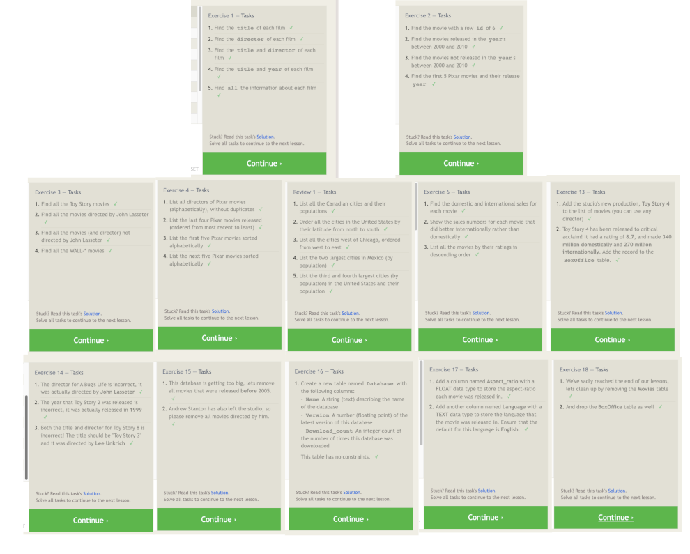

[Return to Course 401 Notes](https://KrisDunning.github.io/401-Reading-Notes)

-----

# Prep-work Introduction to SQL

## SQL Lesson Completion Confirmation

## Notes Summary

SELECT - Command for fetching data.

FROM - Command to determine where data is located.

SPLAT - (*) Gets all available columns.

ASC/DESC - Command for ordering data ascending(ASC) and descending (DESC).

LIMIT - Command to set a limit on number of rows of data returned. 

OFFSET - Command to choose where to start returning data.

WHERE - Command to add limiting conditions on the data query. 

AND - Used to add additional conditions to the query. 

OR - Used to add a condition that could be true. 

NOT - Inverts a condition.

## Things I want to know more about

Joining tables and how to setup schema manually so I understand and get practice.

-----
